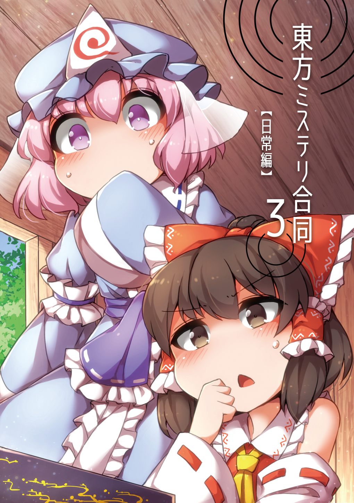
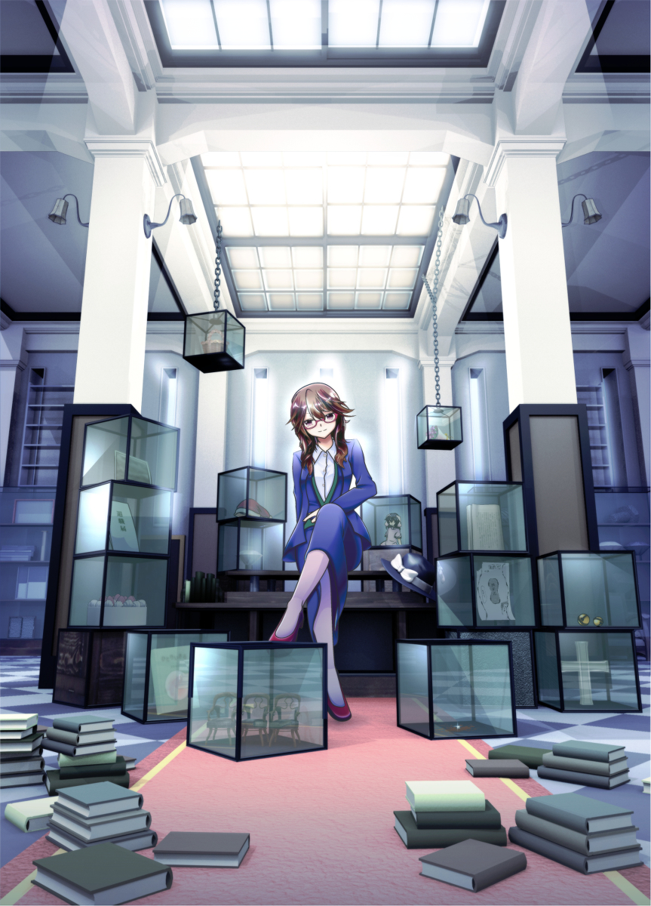

# 東方ミステリ合同誌　第三弾！！！

表紙イラスト by [ふんぼ](https://twitter.com/fun_bo)

## 〝幻想世界の日常ミステリ〟
第三弾となる今回は、「日常編」と「犯罪編」の二本を製作。  
第十六回例大祭にて「日常編」を、コミックマーケット９６にて「犯罪編」を頒布します。  
日常編では「人が死なない」「日常の謎」な東方ミステリ作品を八編収録。

* * *

|タイトル|東方ミステリ合同３　日常編|
|主催|[風切羽](https://twitter.com/zakarikineba)|
|作品情報|Ａ５版２段組　小説７本　漫画１本|
|イベント情報|２０１９年５月５日　第十六回博麗神社例大祭|
|頒布スペース|て-３６ａ|
|イベント頒布価格|１０００円|

## 通販情報
[メロンブックス](https://www.melonbooks.co.jp/detail/detail.php?product_id=502608)

* * *

## 『日常編』収録作品

#### 流し白玉の消失
by [まぜあん](https://twitter.com/kozera_hinami)

イラスト　by [みぞれし](https://twitter.com/mizorec131)
> 博麗神社で開催された流しそうめん大会。その終盤、白玉楼提供のデザート「ふわとろ白玉」が、あうん監視の竹水路から忽然と消えてしまう。  
> 体調不良で留守番をしていた妖夢が導き出した犯人とは――。  
> 風情あふれるほのぼの本格ミステリ。

#### 天国
by [黒猫ルキヤ](https://twitter.com/kuronekorukiya)
> 「ねぇ、日常ミステリって何かしら？」  
> 鈴奈庵での阿求と小鈴の他愛もないミステリ談話。  
> 新作を練る阿求に小鈴は「参考になるから」と来店した知人にある謎の提示を求めた。  
> 「僕の友人が殺された理由が分からないんです」  
> え、これホントに日ミスの参考になるの？  
> 阿求の困惑に小鈴は笑顔で返した。

#### ＸＸを幸せにする方法
by [やこうせいの亀](https://twitter.com/animemania21106)
> 私は社会派ルポライターあや。幼馴染で同級生のはたてが珍しく外に出て取材をしている現場を目撃した。  
> ある夜、湖で妖怪が人間を襲っている事件が起きた。犯人を見るのに夢中になっていた私は、襲われていた人間が忽然と消えていた事に気付かなかった。  
> 人間は一体どこへ消えたのか。  
> 私は犯人に惑わされ、目が覚めたら……。

※漫画作品

#### 春の幻
by [町田一軒家](https://twitter.com/matida_ikkennya)
> 博麗神社の花見の縁日で菫子が引き受けた奇妙な依頼。それは寺子屋に飾られている子どもの絵を盗んできてほしいというものだった。

#### インポッシブル・オペレーション
by [ガニメデ](https://twitter.com/g_comboOOO)
> 蓬莱山輝夜は少名針妙丸と共に『暇つぶしの難題』を考えた。内容は拳銃の射程範囲外にいる八意永琳をいかにして拳銃で殺すかというもの。見事に条件をクリアして永琳を殺した針妙丸は、輝夜と共にその日の夜行われた宴会で難題を披露する。  
> 挑戦者は博麗霊夢、十六夜咲夜、宇佐見菫子の三人。果たして三人は回答を導き出し、針妙丸からご褒美をもらえるのか。

#### 風花
by [アン・シャーリー](https://twitter.com/AnneShirley_)
> 全編が手紙のやりとりで構成された書簡体ミステリ小説です。ある日、射命丸文のもとに一通の手紙が届く。本居小鈴が出したその手紙には、小鈴が書いたという短い戯曲が同封されていた。感想をもとめられ文が出した返事とは。

#### 静かに光りつづけるもの
by [電柱.](https://twitter.com/actgawa)

イラスト　by [みみや](https://twitter.com/foxrainy6)
> プリズムリバー幻楽団の三人が力を合わせ、レイラ・プリズムリバーが生前に残した隠し財産を探す物語です。

#### コウモリであるとはどのようなことか
by [銘宮](https://twitter.com/__meimiya__)
> 暇を持て余していた魔理沙と霊夢は、ごく短い文章から推論を広げていく〝推論ごっこ〟で遊ぶことに。魔理沙がお題に選んだ文章は、『汗かいちゃったわ。後ろの壁が温かくて』という九十九八橋の発言だった。  
> この一文から導き出される、奇妙な推論とは……？

* * *

## 既刊紹介

[東方ミステリ合同２ 心地よく幻想めいた場所](https://kazakiribane201805.tumblr.com/)

[メロンブックス](https://www.melonbooks.co.jp/detail/detail.php?product_id=362266)
